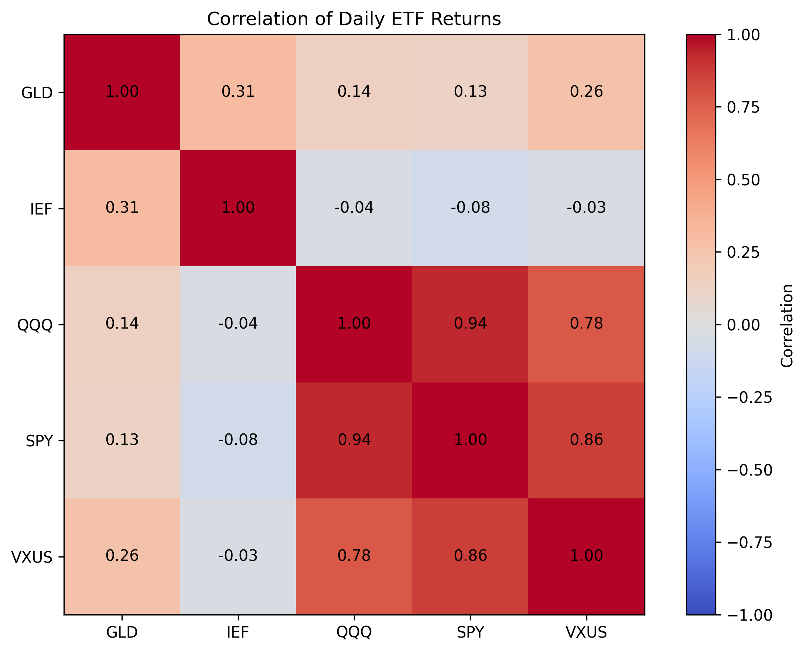
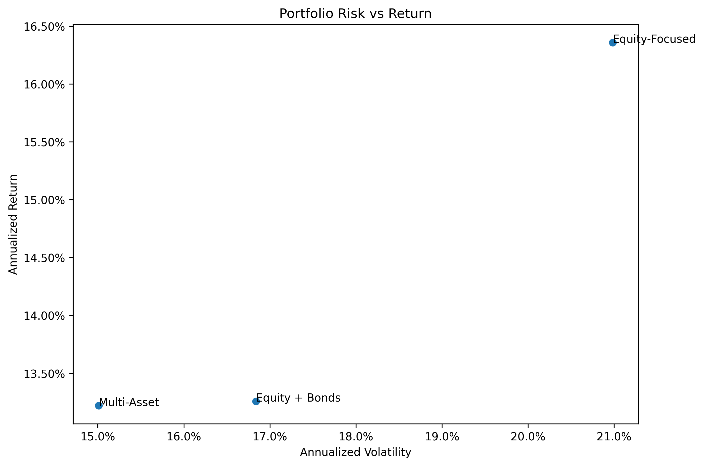
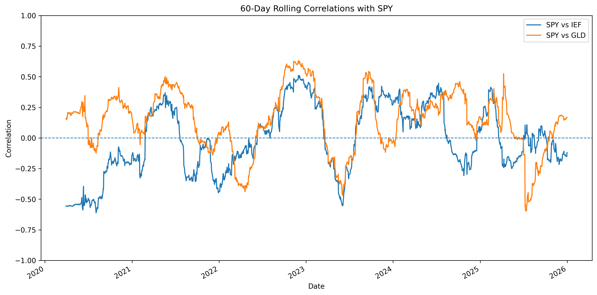
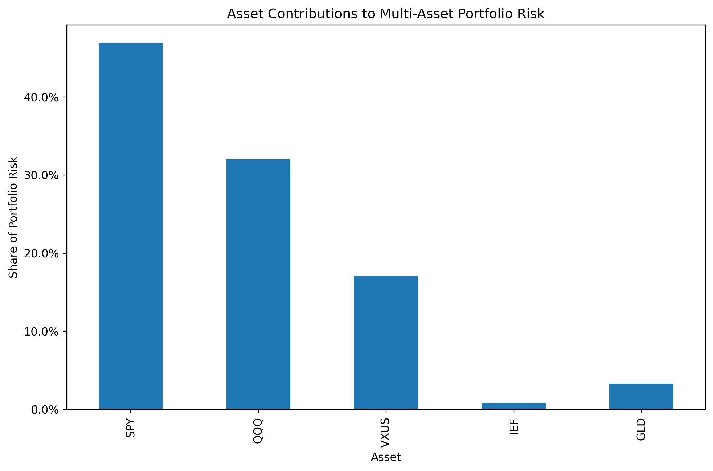

# Multi-Asset Portfolio Risk Analysis

A Python-based quantitative analysis of historical risk, return, correlation, diversification, and portfolio risk across multiple asset exposures.

## Overview

This project investigates how diversification across different financial exposures affects historical portfolio risk and return.

Using daily market data from 2020 through 2025, the analysis examines five exchange-traded funds (ETFs) representing U.S. equities, growth-oriented equities, international equities, U.S. Treasury bonds, and gold.

The project progresses from individual asset analysis to portfolio construction and risk-adjusted performance evaluation. It also examines whether correlations remain stable through time and extends the analysis using covariance-based portfolio risk decomposition and partial derivatives to measure the sensitivity of portfolio volatility to individual asset weights.

## Research Question

**How does diversification across asset classes affect the historical risk and return characteristics of a portfolio?**

A secondary question is:

**How do differences in the correlations between asset returns contribute to portfolio diversification?**

## Assets

| Ticker | Exposure |
|---|---|
| SPY | U.S. large-cap equities |
| QQQ | Nasdaq-100 equities |
| VXUS | International equities excluding the U.S. |
| IEF | U.S. Treasury bonds |
| GLD | Gold |

The assets were selected to provide a combination of equity, fixed-income, international, and alternative-asset exposures.

## Analysis Period

**January 1, 2020 – December 31, 2025**

Daily adjusted market prices are used so that historical return calculations account for relevant distributions and corporate actions.

## Data Sources

- Historical ETF data: Yahoo Finance, accessed through `yfinance`
- Risk-free-rate proxy: 3-Month U.S. Treasury Constant Maturity Rate (`DGS3MO`) from FRED, accessed through `pandas-datareader`

The average 3-month Treasury rate over the sample period was approximately **2.86%**, and this was used as the historical risk-free-rate proxy in the Sharpe ratio calculations.

## Methodology

The analysis is divided into several stages.

### 1. Historical Returns

Adjusted prices are converted into daily percentage returns.

Cumulative returns are then calculated by compounding daily returns through time.

### 2. Individual Asset Risk and Return

For each ETF, the project calculates:

- average daily return
- annualized average return
- daily volatility
- annualized volatility
- cumulative return

Volatility is measured using the standard deviation of historical returns.

A risk-return scatter plot is used to compare the historical return and volatility characteristics of the five assets.

### 3. Correlation and Diversification

Pairwise correlations are calculated using daily ETF returns.

The analysis examines whether different exposures moved closely together or behaved differently during the sample period.

Notable full-period correlations included:

- SPY / QQQ: **0.94**
- SPY / VXUS: **0.86**
- QQQ / VXUS: **0.78**
- SPY / IEF: **-0.08**
- SPY / GLD: **0.13**

The equity ETFs were strongly positively correlated, while Treasury bonds and gold exhibited substantially weaker relationships with equity returns.

### 4. Portfolio Construction

Three hypothetical fixed-weight portfolios are compared.

| Asset | Equity-Focused | Equity + Bonds | Multi-Asset |
|---|---:|---:|---:|
| SPY | 50% | 40% | 35% |
| QQQ | 30% | 25% | 20% |
| VXUS | 20% | 15% | 15% |
| IEF | 0% | 20% | 20% |
| GLD | 0% | 0% | 10% |

The portfolios are intentionally simple and are not intended to represent mathematically optimized allocations. Their purpose is to examine how introducing lower-correlated exposures affects historical portfolio behavior.

### 5. Portfolio Risk and Return

Daily portfolio returns are calculated as weighted combinations of the underlying ETF returns.

Annualized return and volatility are then calculated for each portfolio.

| Portfolio | Annualized Return | Annualized Volatility |
|---|---:|---:|
| Equity-Focused | 16.36% | 20.98% |
| Equity + Bonds | 13.26% | 16.84% |
| Multi-Asset | 13.22% | 15.01% |

The Equity-Focused portfolio generated the highest historical return, but also experienced the highest volatility.

Adding Treasury-bond exposure reduced volatility from **20.98% to 16.84%**. Introducing gold in the Multi-Asset portfolio reduced volatility further to **15.01%**, while its annualized return remained almost identical to that of the Equity + Bonds portfolio.

### 6. Risk-Adjusted Performance

Portfolio performance is also evaluated using the Sharpe ratio:

(R_p-R_f)/σ_p 

where:

- \(R_p\) is annualized portfolio return
- \(R_f\) is the historical risk-free-rate proxy
- \(\sigma_p\) is annualized portfolio volatility

| Portfolio | Annualized Return | Annualized Volatility | Sharpe Ratio |
|---|---:|---:|---:|
| Equity-Focused | 16.36% | 20.98% | 0.64 |
| Equity + Bonds | 13.26% | 16.84% | 0.62 |
| Multi-Asset | 13.22% | 15.01% | **0.69** |

Within the 2020–2025 sample, the **Multi-Asset portfolio produced the highest Sharpe ratio**, indicating the greatest historical excess return relative to volatility among the three portfolios examined.

### 7. Rolling Correlation Analysis

A single full-period correlation coefficient can hide changes in asset relationships through time.

To examine this, the project calculates **60-day rolling correlations** for:

- SPY versus IEF
- SPY versus GLD

Both relationships moved between positive and negative correlation during different parts of the sample.

This demonstrates that diversification relationships are dynamic and that historical correlations should not be assumed to remain constant.

### 8. Marginal Portfolio Risk Analysis

As a mathematical extension, the Multi-Asset portfolio is analyzed using covariance-based portfolio risk decomposition.

Portfolio volatility is represented as:

σ_p=√(w^T Σw)

where:

- w is the vector of portfolio weights
- Σ is the covariance matrix of asset returns
- σ_p is portfolio volatility

The sensitivity of portfolio volatility to the weight of each asset is measured using the partial derivative:

(∂σ_p)/(∂w_i )=(Σw)_i/σ_p 

This provides a **marginal risk measure**, showing how sensitive portfolio volatility is to a small change in each asset's weight around the current allocation.

Component risk is then calculated as:

w_i  (∂σ_p)/(∂w_i )

allowing total portfolio volatility to be decomposed across the individual holdings.

### Marginal Risk Results

| Asset | Weight | Marginal Risk | Component Risk | Share of Portfolio Risk |
|---|---:|---:|---:|---:|
| SPY | 35% | 0.2012 | 7.04 pp | 46.91% |
| QQQ | 20% | 0.2403 | 4.81 pp | 32.02% |
| VXUS | 15% | 0.1703 | 2.55 pp | 17.02% |
| IEF | 20% | 0.0058 | 0.12 pp | 0.78% |
| GLD | 10% | 0.0493 | 0.49 pp | 3.29% |

QQQ had the highest marginal risk, indicating that portfolio volatility was most sensitive to a small change in its weight.

SPY nevertheless contributed the largest share of total portfolio volatility because it also represented the largest allocation.

The three equity exposures represented **70% of portfolio weight but approximately 95.95% of total portfolio risk**.

In comparison, IEF and GLD represented **30% of portfolio weight but only approximately 4.07% of portfolio risk**.

The component risk contributions sum to approximately **15.01 percentage points**, matching the independently calculated annualized volatility of the Multi-Asset portfolio.

## Key Findings

- The equity ETFs were strongly correlated with one another, meaning that holding several equity ETFs did not necessarily provide substantial diversification.
- Treasury bonds and gold exhibited much weaker correlations with equity returns during the sample period.
- Introducing lower-correlated exposures reduced historical portfolio volatility.
- The Equity-Focused portfolio produced the highest return, but also the highest volatility.
- The Multi-Asset portfolio reduced annualized volatility to **15.01%** while maintaining an annualized return of **13.22%**.
- The Multi-Asset portfolio produced the highest Sharpe ratio of the three portfolios at **0.69**.
- Rolling correlations showed that relationships between asset classes changed substantially through time.
- Marginal risk analysis showed that portfolio allocation and portfolio risk contribution were not equivalent: the equity positions accounted for almost **96% of total portfolio volatility** despite representing 70% of portfolio weight.

## Visualizations

### Asset Correlations



The heatmap illustrates the substantially stronger relationships among the equity ETFs compared with the relationships between equities, Treasury bonds, and gold.

### Portfolio Risk vs Return



The portfolio comparison illustrates the reduction in historical volatility as lower-correlated exposures are introduced.

### Rolling Correlations



Rolling correlations demonstrate that asset relationships varied considerably throughout the analysis period.

### Portfolio Risk Contributions



The risk decomposition shows that the equity exposures accounted for the majority of the Multi-Asset portfolio's historical volatility.

## Limitations

- **Historical performance does not imply future performance.** The results describe asset behavior during the 2020–2025 sample period and should not be interpreted as forecasts.

- **Results are sample-period dependent.** Returns, volatility, correlations, and risk contributions could differ substantially over another period.

- **Volatility is the primary measure of risk.** Standard deviation measures variability in returns but does not capture every form of financial risk, including liquidity, credit, and tail risk.

- **Portfolio weights are hypothetical and held constant.** The calculations apply fixed target weights rather than modelling portfolio weight drift and real-world rebalancing costs.

- **Market frictions are excluded.** Transaction costs, taxes, and bid-ask spreads are not modelled.

- **The Sharpe ratio uses a simplified historical risk-free benchmark.** The average 3-month U.S. Treasury rate over the sample period is used rather than allowing the risk-free rate to vary through time within the calculation.

- **Correlation is not constant.** The rolling-correlation analysis demonstrates that diversification relationships can change considerably under different market conditions.

- **Marginal risk is a local sensitivity measure.** Because portfolio weights must sum to 100%, the partial derivative with respect to one asset's weight should not be interpreted as a complete portfolio reallocation strategy.

## Technologies

- Python
- pandas
- NumPy
- Matplotlib
- yfinance
- pandas-datareader
- Jupyter Notebook
- FRED

## Repository Structure

```text
multi-asset-portfolio-risk-analysis/
│
├── data/
│   └── adjusted_close_prices.csv
│
├── figures/
│   ├── asset_risk_return.png
│   ├── correlation_heatmap.png
│   ├── cumulative_asset_returns.png
│   ├── portfolio_cumulative_returns.png
│   ├── portfolio_risk_return.png
│   ├── risk_contributions.png
│   └── rolling_correlations.png
│
├── notebooks/
│   └── portfolio_analysis.ipynb
│
├── README.md
├── requirements.txt
└── .gitignore
```

## Running the Project

Clone the repository:

```bash
git clone https://github.com/rockbjson/multi-asset-portfolio-risk-analysis.git
cd multi-asset-portfolio-risk-analysis
```

Create and activate a Python environment:

```bash
conda create -n portfolio-risk python=3.11
conda activate portfolio-risk
```

Install the required packages:

```bash
pip install -r requirements.txt
```

Launch Jupyter:

```bash
jupyter notebook
```

Then open:

```text
notebooks/portfolio_analysis.ipynb
```

and run the notebook from top to bottom.

## Conclusion

This project demonstrates how diversification depends not simply on the number of investments held, but on how their returns behave relative to one another.

During the 2020–2025 sample period, adding lower-correlated Treasury-bond and gold exposures reduced portfolio volatility. The Multi-Asset portfolio produced the lowest volatility and the highest Sharpe ratio among the three hypothetical allocations examined.

At the same time, rolling correlations showed that asset relationships changed substantially through time, demonstrating that historical diversification benefits are not guaranteed to remain stable.

The marginal risk extension further showed that portfolio weights and portfolio risk contributions can differ substantially, providing a more detailed view of how covariance, asset allocation, and local risk sensitivity interact within a multi-asset portfolio.

---

**Note:** This project is an educational analysis of historical financial data and does not constitute investment advice.
